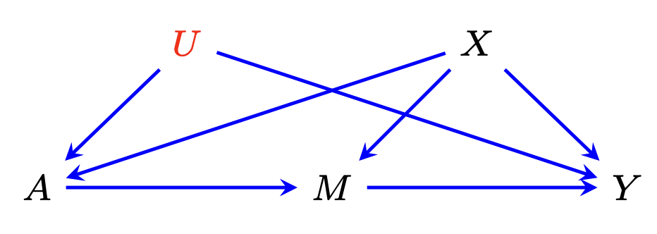

# An R Package for Average Causal Effect Estimation via the Front-Door Functional

---------------

## Contents:

  - ##### [Overview](##Overview)
    + ###### [Intro to Front-Door Model](###Intro)
  - ##### [Installation](##Install)
  - ##### [Estimators](##Estimators)
    + ###### [Onestep Estimator](###Onestep)
    + ###### [Targeted Minimum Loss based Estimator (TMLE)](###TMLE)
  - ##### [Detailed Discussion on Implementation](##Detailed)
    + ###### [Nuisance Estimation](###Nuisance)
    + ###### [Estimation under different types of mediators](###Types)
  - ##### [Output](###Output)
  - ##### [References](##References)


---------

## <a id="Overview"></a>1. Overview

This package is built for estimating the Average Causal Effect (ACE) under the **Front-Door model**. This package is an implementation of the proposed estimators in the following paper. If you find this package useful, please cite this paper:

```
@article{guo2023targeted,
  title={Targeted Machine Learning for Average Causal Effect Estimation Using the Front-Door Functional},
  author={Guo, Anna and Benkeser, David and Nabi, Razieh},
  journal={arXiv preprint arXiv:2312.10234},
  year={2023}
}
```

### <a id="Intro"></a>Intro to Front-Door Model

A front-door model can be depicted in the following Directed Acyclic Graph (DAG), where $A$ is the treatment variable, $M$ is the mediator variable(s), $Y$ is the outcome variable, $X$ is the measured confounder variable(s), and $U$ is the unmeasured confounder(s).



In summary, the **fdtmle** package offers a `TMLE()` function, providing both TMLE estimates and One-step estimates of the Average Causal Effect (ACE). The package is designed to specialize in estimation when $A$ is a univariate binary variable and $Y$ is a univariate variable, which can be either continuous or binary. Additionally, $X$ and $M$ have the flexibility to be either univariate or multivariate, accommodating a wide range of variable types.As a quick example, the package comes with a dataset called `continuousY_continuousM` that looks like the following:


```R
str(continuousY_continuousM)
```

```
'data.frame':	500 obs. of  5 variables:
 $ X: num  0.467 0.338 0.686 0.755 0.137 ...
 $ U: num  3.0707 2.0449 2.521 3.591 0.0665 ...
 $ A: int  1 0 0 1 0 1 0 0 1 0 ...
 $ M: num  2.095 0.527 2.569 4.022 3.189 ...
 $ Y: num  6.22 3.19 5.47 9.45 2.82 ...
```

This dataset is generated with the following DGP

```R
set.seed(7)

## generate continuous outcome Y, continuous mediator M, single measured covariate X====
generate_data <- function(n,parA = c(0.3,0.2), parU=c(1,1,1,0), parM = c(1,1,1,0), parY = c(1, 1, 1, 0), sd.M=1, sd.U=1, sd.Y=1){

  X <- runif(n, 0, 1) # p(X)

  A <- rbinom(n, 1, (parA[1] + parA[2]*X)) # p(A|X)

  U <- parU[1] + parU[2]*A + parU[3]*X + parU[4]*A*X + rnorm(n,0,sd.U) # p(U|A,X)

  M <- parM[1] + parM[2]*A + parM[3]*X + parM[4]*A*X + rnorm(n,0,sd.M) # p(M|A,X)

  Y <- parY[1]*U + parY[2]*M + parY[3]*X + parY[4]*M*X + rnorm(n, 0, sd.Y) # p(Y|U,M,X)

  data <- data.frame(X=X, U=U, A=A, M=M, Y=Y)

  # propensity score
  ps <- A*(parA[1] + parA[2]*X)+(1-A)*(1-(parA[1] + parA[2]*X))

  # mediator density ratio: p(M|a,X)/p(M|A,X)
  m.ratio.a1 <- dnorm(M,parM[1] + parM[2]*1 + parM[3]*X + parM[4]*1*X,sd.M)/dnorm(M,parM[1] + parM[2]*A + parM[3]*X + parM[4]*A*X,sd.M)
  m.ratio.a0 <- dnorm(M,parM[1] + parM[2]*0 + parM[3]*X + parM[4]*0*X,sd.M)/dnorm(M,parM[1] + parM[2]*A + parM[3]*X + parM[4]*A*X,sd.M)

  return(list(data = data,
              parA=parA,
              parU=parU,
              parM=parM,
              parY=parY,
              sd.U=sd.U,
              sd.Y=sd.Y,
              sd.M=sd.M,
              ps=ps,
              m.ratio.a1=m.ratio.a1,
              m.ratio.a0=m.ratio.a0))
}

continuousY_continuousM <- generate_data(500)$data
```

The ACE $E(Y^1)-E(Y^0)$ can be estimated via the `TMLE()` function as follows:

```R

# linkA specifies using "identity" link for fitting the logistic regression of A on X.

cYcM <- TMLE(a=c(1,0),data=continuousY_continuousM,
             treatment="A", mediators="M", outcome="Y", covariates="X",
                      onestep=T, linkA="identity") 
```

In the above code, `a=c(1,0)` specifies estimating ACE, contrasting treatment level $a=1$ verse $a=0$. `onestep=T` specifies output one-step estimator alongside the TMLE estimator.


## <a id="Install"></a>2. How to Install


```R
install.packages("remotes") # If you have not installed "remotes" package
remotes::install_github("annaguo-bios/fdtmle")
```

The source code for **fdtmle** package is available on GitHub at [fdtmle](https://github.com/annaguo-bios/fdtmle/tree/main)

## <a id="Estimators"></a>3. Estimators

For a detailed discussion of the estimators, we refer readers to [Guo et al. 2023].For the ease of derivation, we set the average causal outcome under treatment level $A=a_0$, denoted by $E(Y^{a_0})$, as our target parameter of interest. ACE can be easily constructed as $E(Y^1)-E(Y^0)$. Under front-door model, the target parameter of interest can be identified via the following identification (ID) functional, where $P$ denotes the true observed data distribution:


$$\begin{align*} \psi(P)  = \iint  \sum_{a=0}^1 y \ p(y \mid m, a, x) \  p(a \mid x) \  p(m \mid A=a_0, x) \  p(x) \  dy \  dm\  dx \ .        \quad \text{(target parameter)}      \end{align*}$$


The above ID functional encompasses four nuisance functionals: **the outcome regression** $E(Y\mid M,A,X)$, the **propensity score** $p(A\mid X)$, the **mediator density** $p(M\mid A,X)$, and the marginal distribution of measured confounder(s) $p(X)$. Let $Q$ denotes the collection of the four nuisance functionals: $Q=[E(Y\mid M,A,X),p(A\mid X),p(M\mid A,X),p(X)]$.The nonparametric **Efficient Influence Function (EIF)** for $\psi$ was provided in [Fulcher et al. 2019] and can be written as a sum of four different components:


$$
\begin{align*}
\Phi(Q)(O_i) 
    &= \ \frac{f_M(M_i \mid a_0, X_i)}{f_M(M_i \mid A_i, X_i)} \{ Y_i - \mu(M_i, A_i, X_i) \}
    \ + \ \frac{\mathbb{I}(A_i = a_0)}{\pi(a_0 \mid X_i)} \{\xi(M_i,X_i) - \theta(X_i) \}  \\ 
    &\hspace{0.5cm} + \{\eta(1, X_i) - \eta(0, X_i)\} \{A_i - \pi(1 \mid X_i) \}
   \ + \ \theta(X_i) - \psi(Q) \ . \\
   &\text{where} \\
   &f_M(M\mid A,X)=p(M\mid A,X)\ , \\
   &\mu(M,A,X)=E(Y\mid M,A,X)\ , \\
   &\pi(A\mid X)=p(A\mid X)\ , \\
   &\xi(M,X)=\sum_{a=0}^{1} E(Y\mid M,A,X)\ p(a\mid X) \ , \\
   &\eta(A,X)=\int E(Y\mid M=m,A,X)\ p(m\mid a_0,X)\ dm \ , \\
   &\theta(X)=\sum_{a=0}^{1}\eta(a,X) \ p(a\mid X)\ = \int \xi(M=m,X)\ p(m\mid a_0,X) \ dm\ ,\\
   &\psi(P)\text{: the true value of the target parameter of interest.}
\end{align*}
$$


Those four components corresponding to the projection of the EIF into the tangent space corresponding to $Y\mid M,A,X$, $M|A,X$, $A|X$, and $X$. 

### <a id="Onestep"></a>One-step Estimator

For a dataset with sample size $n$. A doubly robust **One-step Estimator** is suggested by the above EIF as


$$
\begin{aligned} 
\psi(\widehat{Q}) 
    &= \ \sum_{i=1}^{n}\bigg[\frac{\widehat{f}_M(M_i \mid a_0, X_i)}{\widehat{f}_M(M_i \mid A_i, X_i)} \{ Y_i - \widehat{\mu}(M_i, A_i, X_i) \}
    \ + \ \frac{\mathbb{I}(A_i = a_0)}{\widehat{\pi}(a_0 \mid X_i)} \{\widehat{\xi}(M_i,X_i) - \widehat{\theta}(X_i) \}  \\ 
    &\hspace{0.5cm} + \{\widehat{\eta}(1, X_i) - \widehat{\eta}(0, X_i)\} \{A_i - \widehat{\pi}(1 \mid X_i) \}  
   \ + \ \widehat{\theta}(X_i) \ \bigg]\ , \\
   &\text{where } \widehat{\cdot} \text{ denotes nuisance estimate}\ , \\
   &\widehat{Q}=[\widehat{E}(Y\mid M,A,X),\ \widehat{p}(A\mid X),\ \widehat{p}(M\mid A,X),\ \widehat{p}(X)]\ , \\
   &\widehat{p}(X) \text{ is the empirically estimated distribution of $X$, i.e. each value of $x$ observed in the data is assigned probability $p(X=x)=1/n$, otherwise $p(X=x)=0$}.
\end{aligned}
$$


### <a id="TMLE"></a>Targeted Minimum Loss based Estimator (TMLE)


For a dataset with sample size $n$. A **Targeted Minimum Loss based Estimator (TMLE)** can be constructed by updating the nuisance estimate $\widehat{f}_M,\,\widehat{\mu},\widehat{\pi}$ in $\widehat{Q}$. The TMLE-based nuisance estimate is denoted using $\widehat{\cdot}^\star$ as $\widehat{Q}^\star=[\widehat{E}^\star(Y\mid M,A,X),\ \widehat{\pi}^\star(A\mid X),\ \widehat{f}_M^\star(M\mid A,X),\ \widehat{p}(X)]$. The TMLE is then constructed based on the updated nuisance functionals as


$$
\begin{align*}
\psi(\widehat{Q}^\star) =  \iint  \sum_{a=0}^1 \widehat{\mu}^\star(y\mid m,a,x) \  \widehat{\pi}^\star(a \mid x) \  \widehat{f}_M^\star(m \mid A=a_0, x) \  \widehat{p}(x) \  dm\  dx \ .    
\end{align*}
$$


The detailed TMLE procedure for updating the nuisance functionals varies according to different variable types and can involve iterative updates among nuisances. As an illustration, we show how to update the outcome regression under continuous outcome $Y$. For a detailed discussion of TMLE, we refer readers to [Van der Laan et al. 2011]. For a specific discussion of TMLE algorithm for front-door model, refer to [Guo et al. 2023].The initial outcome regression estimate $\widehat{\mu}$ is updated by finding a combination of submodel and loss function as follows:


$$
\begin{aligned}
\widehat{\mu}(\varepsilon_Y)(M, A, X) &= \widehat{\mu}(M, A, X) + \varepsilon_Y \ , \ \varepsilon_Y \in \mathbb{R},
\\
L_Y\left(\widetilde{\mu};\widehat{f}_M^\star \right)(O) &= \frac{\widehat{f}_M^\star(M \mid a_0, X)}{\widehat{f}_M^\star(M \mid A, X)} \{ Y - \widetilde{\mu}(M, A, X) \}^2 \ .
\end{aligned}
$$


Put $\widehat{\mu}(\varepsilon_Y)(M, A, X)$ in the place of $\widetilde{\mu}$ in the loss function, and find $\varepsilon_Y^\star$, which minimizes the loss function $L_Y(\widehat{\mu}(\varepsilon_Y);\widehat{f}_M^\star )$. $\widehat{\mu}$ is then updated as $$\widehat{\mu}^\star=\widehat{\mu}+\varepsilon_Y^\star$$


## <a id="Detailed"></a>4. Detailed Discussion on Implementation

### <a id="Nuisance"></a>4.1 Nuisance estimation 


The **TmleFrontdoor** package offers multiple ways for estimating the nuisance functionals.

- <span style="color:red;">**Regression**</span>: the default method for estimating $E(Y\mid M,A,X)$ and $\pi(A\mid X)$ is via linear or logistic regression. The mediator density $f_M(M\mid A,X)$ is estimated with logistic regression under \underline{univariate binary} mediator. For other types of mediator, we defer discussion to the mediator density estimation section. When nuisance functionals are estimated via regression based methods, the package allows user to specify the regression formula with argument 'formulaY', 'formulaA', and 'formulaM' for outcome regression, propensity score, and mediator density respectively. For binary variables, the link function used in logistic regression can be specified via 'linkY_binary', 'linkA', and 'linkM_binary'. For example

  Set $a=1$ returns estimation results on $E(Y^1)$.

  ```R
  # binary Y and binary M
  bYbM<- TMLE(a=1,data=binaryY_binaryM,
              treatment="A", mediators="M", outcome="Y", covariates="X",
              onestep=T,
             formulaY="Y ~ .", formulaA="A ~ .", formulaM="M~.", linkY_binary="logit", linkA="identity", linkM_binary="logit")
  ```

  

- <span style="color:red;">**Super learner**</span>: use argument `superlearner=T` in the `TMLE()` function to estimate nuisance functionals with [SuperLearner](https://cran.r-project.org/package=SuperLearner). The SuperLearner is an ensemble algorithm that combines estimates from various statistical and machine learning models, creating a more adaptable and robust estimation. The default algorithms used for superlearner in **fdtmle** package is `c("SL.glm","SL.earth","SL.ranger","SL.mean")`. Users can specify any algorithms incorporated in the [SuperLearner](https://cran.r-project.org/package=SuperLearner) package.
-  <span style="color:red;">**Cross-fitting with super learner**</span>: use argument `crossfit=T` in `TMLE()` function to estimate nuisance functionals using cross-fitting in conjuction with super learner. More specifically, data are partitioned into K non-overlapping subsets of approximately equal size. For observations in each fold, prediction is made using super learner trained using observations excluding those in the current fold. Predictions for each fold is then combined to form the nuisance estimates for all observations. By adopting cross-fitting, the Donsker condition is no longer required for achieving asympotical linearity of the estimators. The number of folds can be adjusted using argument `K` with the default be `K=5`. As an example, the following code implements ACE estimation using random forest combined with cross-fitting of 2 folds.

```R
set.seed(7)

cYcM <- TMLE(a=c(1,0),data=continuousY_continuousM_10dX, treatment="A", mediators="M", outcome="Y", covariates=paste0("X.",1:10), 
             onestep=T, crossfit = T, lib = c("SL.ranger"), K=2)
```


### <a id="Types"></a>4.2 Estimation under different types of mediators


This package incorporates different estimation schemes tailored to various types of mediators. As mentioned in subsection~4.1, $f_M(M\mid A,X)$ is estimated via logistic regression under binary mediators. Different estimation strategies would be needed to handle other types of mediators. The mediator estimation is controlled by argument `mediator.method` with the default be `mediator.method=bayes`. We offer four estimation options towards mediator density:

- <span style="color:red;"> mediator.method=np </span>: This method corresponding to direct estimation and targeting of the _mediator density_. When `np.dnorm=F`, $f_M(M\mid A,X)$ is estimated using the nonparametric kernel method via the [np](https://cran.r-project.org/web/packages/np/index.html) package. When `np.dnorm=T`, $f_M(M\mid A,X)$ is estimated assuming normal distribution. The mean of the normal distribution is estimated via main terms regression of $M$ on $A$ and $X$, and the standard deviation of the normal distribution is estimated as the sample standard devation of the error term of the regression. Given the computational burden imposed by direct estimation of the mediator density, this `np` method is only applicable to univariate continuous mediator.

- <span style="color:red;"> mediator.method=densratio </span>: This method circumvent direction estimation of the mediator density by estimating its ratio $f_M(M\mid A=a_0,X)/f_M(M\mid A,X)$ instead, where $a_0$ is the treatment level intervened. _Density ratio_ estimation is achieved via the [densratio](https://cran.r-project.org/web/packages/densratio/index.html) package.

- <span style="color:red;"> mediator.method=bayes </span>: This method estimate _density ratio_ $f_M(M\mid A=a,X)/f_M(M\mid A,X)$ by reformula it with the Bayes' Theorem as follows

  $$\frac{f_M(M\mid A=a,X)}{f_M(M\mid A,X)} = \frac{p(a_0 \mid X, M)}{p(A \mid X, M)} \times \frac{\pi(A \mid X)}{\pi(a_0 \mid X)}.$$

  The density ratio is estimated via estimating $p(A \mid X, M)$ and $\pi(A\mid X)$. $p(A \mid X, M)$ can be estimated via super learn, cross-fitting in conjunction with super learner, or logistic regression. When using logistic regression, `formula_bayes` and `link_bayes` arguments in `TMLE()` allow users to specify the formula and link function used in logistic regression.

- <span style="color:red;"> mediator.method=dnorm </span>: This method estimate _density ratio_, assuming that $M\mid A,X$ follows conditional normal distribution. The mean and standard deviation of the normal distribution is estimated using the same strategy as discussed under `mediator.method=np`. Estimates of the density ratio is then constructed as the ratio of the normal density.

**Summary:** the `np` method allows estimation under univariate continuous mediator. The `densratio, bayes, dnorm` methods work for both univariate and multivariate mediators. The mediators can be binary, continuous, or a mixture of those two types. The `np` method involves direct estimation of the mediator density, and iterative updates among the outcome regression, propensity score, and mediator density in the TMLE procedure. Consequently, this method requires longer computational time. The TMLE procedure under `densratio, bayes, dnorm` does not require iterative updates among the nuisance functionals. Therefore, those methods are more computational efficient and is especially appealing to settings with multivariate mediators. 


## <a id="Output"></a>5. Output

The output of the `TMLE()` function depends on the `mediator.method` used. As an example, we use `mediator.method=np` to estimate the average counterfactual outcome $E(Y^1)$. The output is described as follows

```R
set.seed(7)

# Set a=1 returns estimation results on E(Y)
cYcM <- TMLE(a=1,data=continuousY_continuousM, treatment="A", mediators="M", outcome="Y", covariates="X", 
             onestep=T, mediator.method = "np")

## TMLE output ##
cYcM$TMLE$estimated_psi # point estimate of the target parameter E(Y^1).
cYcM$TMLE$lower.ci # lower bound of the 95% confidence interval for the E(Y^1) estimate.
cYcM$TMLE$upper.ci # upper bound of the 95% confidence interval for the E(Y^1) estimate.
cYcM$TMLE$p.M.aX # mediator density estimate at treatment level A=a.
cYcM$TMLE$p.M.AX # mediator density estimate at treatment level A=A.
cYcM$TMLE$p.a1.X_updated # propensity score estimate at treatment level A=1.
cYcM$TMLE$or_pred_updated # outcome regression estimate.
cYcM$TMLE$EIF # estimated efficient influence function evaluated at all observations. 
              #EIF can be used to construct confidence interval for E(Y^1).
cYcM$TMLE$EDstar # a vector composes of the sample average of the projection of EIF onto the tangent space corresponding to Y|M,A,X; M|A,X; and A|X.
                 # upon convergence of the algorithm, elements of this vector should be close to 0.
cYcM$TMLE$EDstar_M.vec # sample average of the projection of EIF onto tangent space of M|A,X over iterative updates of the nuisance functionals.
                       # the elements in this vector should converge to zero over iterations.
cYcM$TMLE$EDstar_ps.vec # sample average of the projection of EIF onto tangent space of A|X over iterative updates of the nuisance functionals.
                        # the elements in this vector should converge to zero over iterations.
cYcM$TMLE$eps2_vec # the indexing parameter for submodels for the mediator density over iterations.
                   # the elements in this vector should converge to zero over iterations.
cYcM$TMLE$eps3_vec # the indexing parameter for submodels for the propensity score over iterations.
                   # the elements in this vector should converge to zero over iterations.
cYcM$TMLE$iter # number of iterations upon convergence.

## One-step estimator output ##
cYcM$Onestep$estimated_psi # point estimate of the target parameter E(Y^1).
cYcM$Onestep$theta_x # estimate of theta(X) as defined in the Section~3
cYcM$Onestep$lower.ci # lower bound of the 95% confidence interval for the E(Y^1) estimate.
cYcM$Onestep$upper.ci # upper bound of the 95% confidence interval for the E(Y^1) estimate.
cYcM$Onestep$EIF # estimated efficient influence function evaluated at all observations. 
cYcM$Onestep$EDstar # a vector composes of the sample average of the projection of EIF onto the tangent space corresponding to Y|M,A,X; M|A,X; and A|X.
```


In the following, we use `mediator.method=bayes` to estimate ACE. The output is described as follows 

```R
set.seed(7)

cYcM <- TMLE(a=c(1,0),data=continuousY_continuousM_10dX, treatment="A", mediators="M", outcome="Y", covariates=paste0("X.",1:10), 
             onestep=T, mediator.method = "bayes")

## TMLE output ##
ACE <- cYcM$TMLE$ATE # point estimate of the target parameter ACE.
lower.ci <- cYcM$TMLE$lower.ci # lower bound of the 95% confidence interval for the ACE estimate.
upper.ci <- cYcM$TMLE$upper.ci # upper bound of the 95% confidence interval for the ACE estimate.
EIF <- cYcM$TMLE$EIF # estimated efficient influence function evaluated at all observations. 
                     #EIF can be used to construct confidence interval for E(Y^1).

E.Y1.obj <- cYcM$TMLE.Y1 # oject containing estimation results on E(Y^1).
E.Y1.obj$estimated_psi # point estimate of the target parameter E(Y^1).
E.Y1.obj$lower.ci # lower bound of the 95% confidence interval for the E(Y^1) estimate.
E.Y1.obj$upper.ci # upper bound of the 95% confidence interval for the E(Y^1) estimate.
E.Y1.obj$theta_x # estimate of theta(X) as defined in the Section~3
E.Y1.obj$M.AXratio # estimate of the mediator density ratio f_M(M|A=1,X)/f_M(M|A,X)
E.Y1.obj$p.a1.X # propensity score estimate at treatment level A=1.
E.Y1.obj$or_pred # outcome regression estimate.
E.Y1.obj$EIF # estimated efficient influence function evaluated at all observations. 
              #EIF can be used to construct confidence interval for E(Y^1).
E.Y1.obj$EDstar # estimated efficient influence function evaluated at all observations. 
              #EIF can be used to construct confidence interval for E(Y^1).


E.Y0.obj <- cYcM$TMLE.Y0 # oject containing estimation results on E(Y^0)
# similar story as E.Y1.obj#

## One-step estimator output ##
ACE <- cYcM$Onestep$ATE # point estimate of the target parameter ACE.
lower.ci <- cYcM$Onestep$lower.ci # lower bound of the 95% confidence interval for the ACE estimate.
upper.ci <- cYcM$Onestep$upper.ci # upper bound of the 95% confidence interval for the ACE estimate.
EIF <- cYcM$Onestep$EIF # estimated efficient influence function evaluated at all observations. 
              #EIF can be used to construct confidence interval for E(Y^1).

E.Y1.obj <- cYcM$Onestep.Y1
# similar story as E.Y1.obj for TMLE #

E.Y0.obj <- cYcM$Onestep.Y0
# similar story as E.Y1.obj for TMLE #
```

Output under mediator method `densratio, dnorm` is the same as above.


## <a id="References"></a>References
- [Guo et al. 2023] Guo, A., Benkeser, D., & Nabi, R. **Targeted Machine Learning for Average Causal Effect Estimation Using the Front-Door Functional.** arXiv preprint arXiv:2312.10234, 2023.
- [Fulcher et al. 2019] Fulcher I R, Shpitser I, Marealle S, et al.**Robust inference on population indirect causal effects: the generalized front door criterion.**Royal Statistical Society Series B: Statistical Methodology, 2020.
- [Van der Laan et al. 2011] Van der Laan M J, Rose S.**Targeted learning: causal inference for observational and experimental data.**New York: Springer, 2011.

